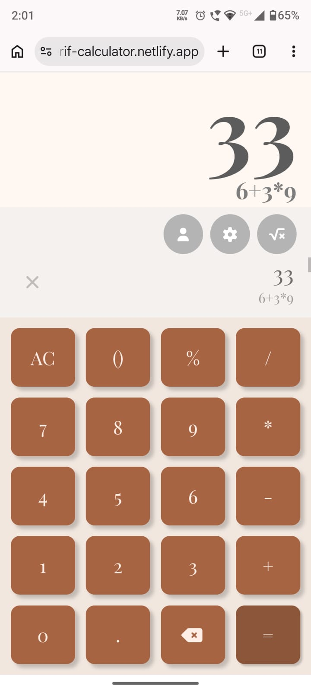

# Serif Calculator

A calculator that doesn't look like every other calculator. Built with a serif typeface, soft terracotta tones, and smooth grow/shrink animations instead of instant snaps — designed to feel calm and considered rather than purely functional.

**[Live Demo →](https://serif-calculator.netlify.app/)**

 


---

## ✨ Features

- **Full arithmetic support** — addition, subtraction, multiplication, division, percentages, and parentheses with smart nesting
- **Calculation history** — every result is saved and viewable, with a hover-to-reveal delete button per entry
- **Smooth animations** — the result and equation displays grow and shrink into place instead of appearing instantly
- **Responsive layout** — adapts from a two-column desktop layout to a stacked mobile layout, with the button grid and history both properly space-constrained to fit any screen
- **Keyboard support** — full calculator functionality is also available via keyboard input, not just clicks
- **Distinct typography** — set in Playfair Display, a serif font choice that gives the interface a more editorial, less clinical feel than the typical calculator UI

## 🚧 Coming Soon

- Scientific calculator mode (trigonometric functions, exponents, logarithms, and more)

## 🛠️ Built With

- HTML5
- CSS3 (Grid & Flexbox, CSS animations)
- Vanilla JavaScript (no frameworks)

## 🚀 Getting Started

Clone the repo and open `index.html` in your browser — no build step or dependencies required.

```bash
git clone https://github.com/subom7/Serif-calculator.git
cd your-repo-name
```

Then open `index.html` directly, or serve it locally (e.g. with the VS Code Live Server extension) for the best experience.

## 📁 Project Structure

```
├── index.html
├── styles.css
└── scripts/
    ├── script.js
    ├── operations.js
    ├── history.js
    └── utils/
        └── string-utils.js
```